  

  

## 🛠️ Tech Stack

<table>
<tr><td width="150"><b>Web & Mobile</b></td><td>      </td></tr>
<tr><td width="150"><b>UI & Visualization</b></td><td>    </td></tr>
<tr><td width="150"><b>Backend & Data</b></td><td>        </td></tr>
<tr><td width="150"><b>AI & Agents</b></td><td>      </td></tr>
<tr><td width="150"><b>Tools & Integration</b></td><td>  </td></tr>
</table>

## 🏎️ 프로젝트 및 대회 참가

### [정책핏 인천](https://github.com/rokmc1893/INU-X-UOU) · 🏆 장려상

- **대회:** [초광역 지역문제 해결형 해커톤](https://rnd.incheon.ac.kr/linc/online/edu_view.do?edu_pbanc_sn=60) · **주최:** 인천대학교 × 울산대학교 · **팀:** F4
- **개발 내용:** 산업 수요와 정책을 비교해 **지원 공백·중복 후보 분석 및 검토서 초안 생성**
- **기술:** Python, Streamlit, Neo4j, OpenAI, Next.js

### Ulsainer

- **대회:** [2026 관광데이터 활용 공모전](https://api.visitkorea.or.kr/) · **주최:** 한국관광공사
- **개발 내용:** **관광지 탐색·미션·커뮤니티·방문 기록** 기능을 갖춘 모바일 앱
- **기술:** React Native, Expo, TypeScript, Supabase, Kakao SDK

### [Deepgle Legal](https://github.com/ulsanung-del/legal-screening-assistant)

- **대회:** [2026 Google AI Agent Challenge](https://aisw.daegu.ac.kr/article/photo25/detail/222842) 예선
- **주최:** 경북대·대구대·영남대·울산대·한동대 SW중심대학
- **개발 내용:** **위험 조항·근거 법령·검토 보고서**를 한 화면에서 확인하는 AI 계약서 분석 서비스
- **기술:** React, TypeScript, FastAPI, Gemini, LangGraph, Chroma

### [US Vibe](https://github.com/US-VIBE/us_vibe) · AI 협업 학습 시뮬레이터

- **담당 역할:** **워크스페이스 UI 개발, 채팅·API 연동, 산출물 AI 평가**
- **개발 내용:** AI 팀원과 역할 분담·채팅·산출물 리뷰·회고를 진행하는 협업 학습 서비스
- **기술:** Next.js, TypeScript, NestJS, PostgreSQL, Redis, OpenAI

### [결혼·출산 준비 헬스케어](https://github.com/rokmc1893/Capstone-Design)

- **담당 역할:** **온보딩, 로그인·인증 연동, 미션·검사 리포트 UI 개발**
- **개발 내용:** 건강 지표·검사 결과 시각화와 미션·커뮤니티 기능을 갖춘 건강 관리 모바일 웹
- **기술:** React, TypeScript, Vite, Zustand, Recharts, Tailwind CSS

<b>🤝 More Projects & Collaboration</b>

 
<table>
<tr><td width="50%" valign="top"><h4>👕 <a href="https://github.com/UOUHCI/UOU_HCI_02_FE">3D 아바타 패션 UI ↗</a></h4>
상품 탐색 · 3D 아바타 · 의상 미리보기

    
</td>
<td width="50%" valign="top"><h4>🐾 배웅길 비공개</h4>
반려동물 장례시설 탐색 · 비용 비교 · 추모영상

   
</td></tr>
</table>

## 🟩 Season Telemetry / 3D Contributions

  <picture>
    <source media="(prefers-color-scheme: dark)" srcset="./profile-3d-contrib/profile-night-green.svg">
    <source media="(prefers-color-scheme: light)" srcset="./profile-3d-contrib/profile-green.svg">
    
  </picture>
  
One contribution. One better lap. 매일 쌓아가는 개선의 기록.

<b>📊 Open Telemetry — 통계 · 사용 언어 · 저장소 카드</b>

 

  
  

 

  
  
  

---

  
<b>Build with purpose. Tune with precision. Ship as a team.</b>

  
  
See you on the next lap. 🏁

