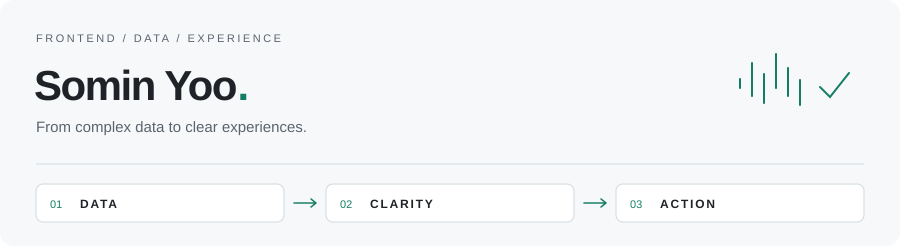

<picture>
  <source media="(prefers-color-scheme: dark)" srcset="./assets/profile-dark.svg">
  <source media="(prefers-color-scheme: light)" srcset="./assets/profile-light.svg">
  
</picture>

### 복잡한 데이터를, 명확한 경험으로.

안녕하세요, **프론트엔드 개발자 유소민**입니다.  
React와 TypeScript로 데이터의 흐름을 설계하고, 사용자가 빠르게 이해하고 판단할 수 있는 화면을 만듭니다.

[Email ↗](mailto:smin0108@gmail.com) · [Projects ↓](#selected-work) · [GitHub ↗](https://github.com/rokmc1893?tab=repositories)

---

### Focus

**01 / Interface** — 복잡한 정보를 직관적인 UI와 관제·모니터링 화면으로 구조화합니다.  
**02 / Connection** — API, 서비스 데이터, AI 모델을 하나의 사용자 경험으로 연결합니다.  
**03 / Delivery** — 기획부터 구현·검증·배포까지 제품의 흐름을 이어갑니다.

### Selected Work

#### 01 — AI 맞춤형 헬스케어
건강 지표를 읽기 쉬운 화면으로, 꾸준한 관리는 식물을 키우는 경험으로.

기획과 프론트엔드 개발을 주도하고, 건강 데이터 시각화와 게이미피케이션을 구현했습니다.

`React` `TypeScript` `Tailwind CSS` `Zustand` `Recharts`  
[프로젝트 살펴보기 ↗](https://github.com/rokmc1893/Capstone-Design)

#### 02 — Deepgle Legal
계약서 업로드부터 위험 조항과 근거 법령 확인까지, 하나의 흐름으로.

AI 계약서 스크리닝과 결과 대시보드를 연결하는 서비스를 구축했습니다.

`React` `TypeScript` `FastAPI` `Gemini` `LangGraph` `ChromaDB` `Docker`  
[프로젝트 살펴보기 ↗](https://github.com/rokmc1893/Google_AI_Agent)

#### 03 — 정책핏 인천
정책 사이의 지원 공백과 중복 후보를 드러내는 의사결정 지원 도구.

정책 데이터를 규칙 기반으로 분석하고, 검토 결과를 확인하는 Streamlit 앱을 만들었습니다.

`Python` `Streamlit` `Neo4j` `OpenAI API` `Pytest`  
[프로젝트 살펴보기 ↗](https://github.com/rokmc1893/INU-X-UOU)

---

### Toolkit

| 영역 | 사용하는 기술 |
| :--- | :--- |
| Frontend | React · TypeScript · Next.js · Vite · Tailwind CSS |
| Data & Backend | Python · FastAPI · Streamlit · Neo4j |
| AI & Workflow | Gemini · LangGraph · Docker · Git · Claude · Codex |

조금 더 알아보기

 

- 울산대학교 **IT융합학과**에서 소프트웨어와 데이터 통신의 기본기를 쌓고 있습니다.
- 데이터 시각화와 관제·모니터링 인터페이스에 관심이 있습니다.
- Claude와 Codex를 요구사항 정리, 구현, 리팩터링, 테스트에 활용하고 결과는 직접 실행해 검증합니다.

