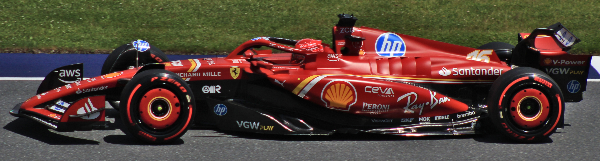
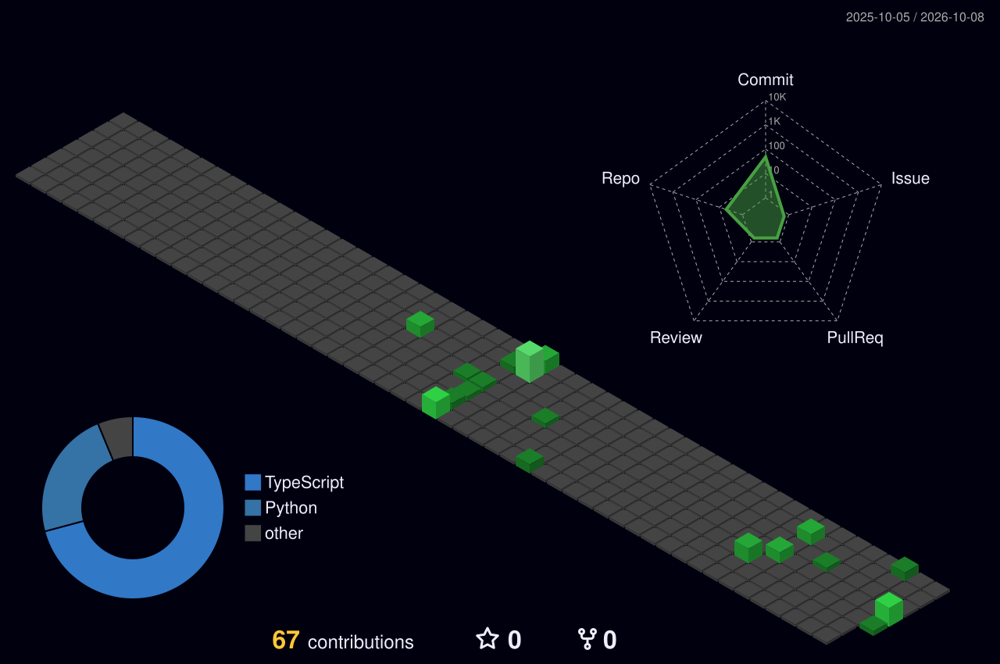

<h2>SOMIN YOO · ENGINEERING GARAGE</h2>

<strong>SPEED / PRECISION / TEAMWORK</strong>

Photo: <a href="https://commons.wikimedia.org/wiki/User:Lukas_Raich">Lukas Raich</a> · <a href="https://commons.wikimedia.org/wiki/File:FIA_F1_Austria_2024_Nr._16_Leclerc_(side)_(cropped).jpg">Wikimedia Commons</a> · <a href="https://creativecommons.org/licenses/by-sa/4.0/">CC BY-SA 4.0</a> · Crop: Mb2437

**복잡한 데이터는 명확하게. 사용자 경험은 매끄럽게.**  
Frontend Developer · React & TypeScript · 울산대학교 IT융합학과

<!-- 블로그 주소를 추가할 때 같은 위치에 for-the-badge 링크를 넣습니다. -->

## 🏁 Driver Briefing

좋은 레이스는 빠른 차만으로 완성되지 않습니다. 정확한 튜닝과 팀의 호흡이 필요합니다.  
저는 **데이터를 읽고 연결해, 사용자가 빠르게 판단할 수 있는 인터페이스**를 만드는 개발자입니다.

- **Speed** — 코드의 병목을 찾아 다듬는 일을 F1 엔진 튜닝처럼 즐깁니다. 빠른 실행과 매끄러운 화면을 함께 고민합니다.
- **Precision** — API·서비스 데이터·AI 모델의 흐름을 이해하고, 복잡한 정보를 직관적인 UI로 구조화합니다.
- **Teamwork** — 협업은 타이밍이 맞는 피트스탑이라고 생각합니다. 명확한 소통과 실행 검증으로 팀의 다음 랩을 준비합니다.

🌱 **Currently learning** <!-- 사용자 요청에 따라 비워둠 -->  
🔭 **Currently working on** — 데이터가 사용자 경험으로 이어지는 프론트엔드와 AI 서비스  
💬 **Ask me about** — React · TypeScript · 데이터 시각화 · AI 서비스 연동

## 🛠️ Under the Hood

#### Frontend / Cockpit

#### Backend & Data / Power Unit

#### DevOps & Tools / Pit Crew

## 🏎️ Race Garage / Selected Projects

| 머신 | 해결하려는 문제 | 주력 기술 |
| :--- | :--- | :--- |
| [**AI 맞춤형 헬스케어 ↗**](https://github.com/rokmc1893/Capstone-Design) | 건강 지표를 시각화하고 식물 키우기 경험으로 꾸준한 관리를 돕습니다. | React · TypeScript · Recharts |
| [**Deepgle Legal ↗**](https://github.com/rokmc1893/Google_AI_Agent) | 계약서 위험 조항과 근거 법령을 이해하기 쉬운 화면으로 연결합니다. | React · FastAPI · Gemini · LangGraph |
| [**정책핏 인천 ↗**](https://github.com/rokmc1893/INU-X-UOU) | 정책 사이의 지원 공백과 중복 후보를 규칙 기반으로 분석합니다. | Python · Streamlit · Neo4j |

## 🟩 Season Telemetry / 3D Contributions

  <picture>
    <source media="(prefers-color-scheme: dark)" srcset="./profile-3d-contrib/profile-night-green.svg">
    <source media="(prefers-color-scheme: light)" srcset="./profile-3d-contrib/profile-green.svg">
    
  </picture>
  
One contribution. One better lap. 매일 쌓아가는 개선의 기록.

<b>📊 Open Telemetry — 통계 · 사용 언어 · 저장소 카드</b>

 

  
  

 

  
  
  

---

  
<b>Build with purpose. Tune with precision. Ship as a team.</b>

  
  
See you on the next lap. 🏁

